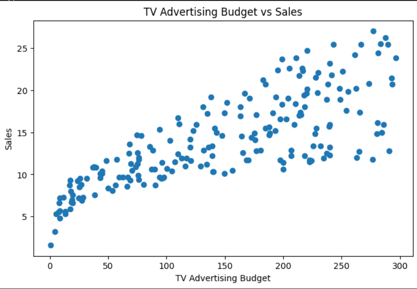
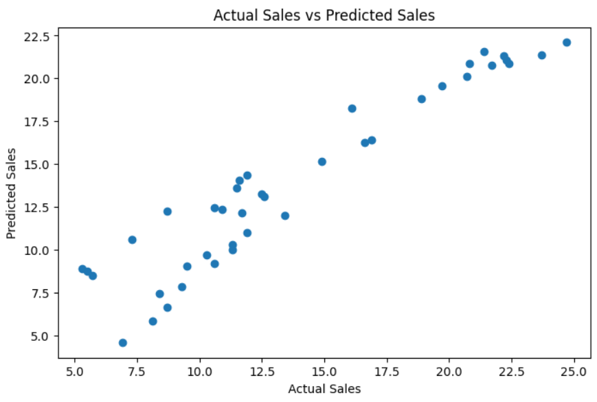

# Predictive Analytics Using Historical Data

## Overview
This project demonstrates the implementation of predictive analytics using Machine Learning techniques on historical advertising and sales data. The objective of this project is to predict future sales trends based on TV, Radio, and Newspaper advertising budgets using a Linear Regression model.

The project includes:
- Data preprocessing
- Data visualization
- Model training
- Sales prediction
- Performance evaluation

---

## Technologies Used
- Python
- Pandas
- NumPy
- Matplotlib
- Scikit-learn
- Google Colab

---

## Machine Learning Algorithm
### Linear Regression
Linear Regression is used to predict future sales based on historical advertising data.

---

## Features
- Data Cleaning and Preprocessing
- Predictive Analytics using Machine Learning
- Data Visualization
- Future Sales Forecasting
- Model Performance Evaluation

---

## Evaluation Metrics
- Mean Absolute Error (MAE)
- Mean Squared Error (MSE)
- Root Mean Squared Error (RMSE)
- R2 Score

---

## Output Results

### TV Advertising Budget vs Sales



---

### Actual Sales vs Predicted Sales



---

## How to Run the Project

### Install Required Libraries

```bash
pip install -r requirements.txt
```

### Run the Notebook
Open the Jupyter Notebook or Google Colab and run all cells.

---

## Future Improvements
- Deploy as a Streamlit web application
- Use advanced Machine Learning algorithms
- Add real-time forecasting dashboard

---

## Author
### Gowtham N
